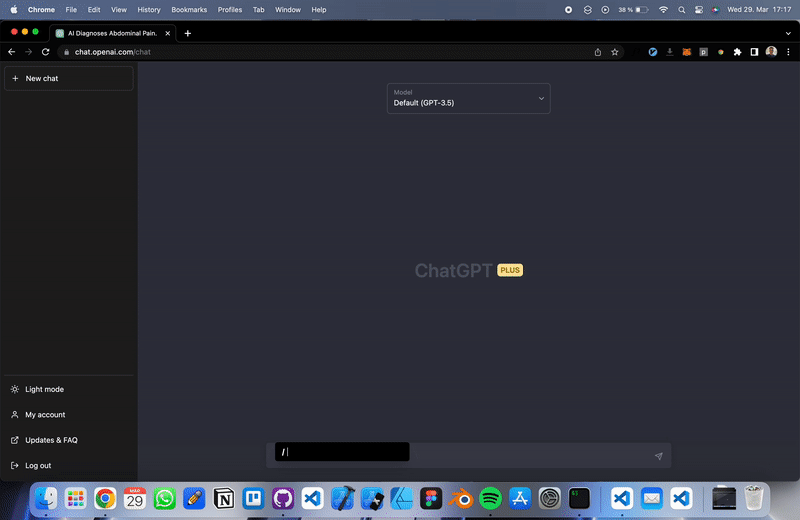

<div align="center">
  <h1>Prompster</h1>
  <p><strong>Slash commands for AI chat apps</strong></p>
  <p>
    <a href="https://chromewebstore.google.com/detail/prompster/fbagfekcjdidpmmookklbaeddgkjddml">
      
    </a>
    <a href="https://addons.mozilla.org/en-US/firefox/addon/prompster/">
      
    </a>
  </p>
</div>

**To discuss adding a new chat app, please comment here: https://github.com/LucasAschenbach/prompster/discussions/5**

Prompster is a browser extension that streamlines your experience across AI chat apps by providing quick access to a rich and customizable prompt library. Type your configured trigger character followed by the prompt name to insert the prompt directly into the chat input field. You can change the trigger character in the extension settings. Prompster ships with a set of predefined prompts in [static/default_prompts.json](https://github.com/LucasAschenbach/prompster/blob/main/static/default_prompts.json), and you can customize or extend that library from the extension popup.



## Supported Chat Apps

### Main apps
- ChatGPT
- Claude
- Gemini
- Perplexity
- Microsoft Copilot
- Grok
- T3 Chat
- Poe

<details>
  <summary>More supported chat apps and playgrounds</summary>

- Google AI Studio
- Meta AI
- DeepSeek
- Mistral Le Chat
- Duck.ai
- HuggingChat
- OpenRouter Chat
- OpenAI Playground
- Groq Playground
- AgentGPT
</details>

## How it works
1. Type your configured trigger character in an input field on the site.
2. An autocomplete window with a textfield will appear above the input field.
3. As you type your prompt keyword, the window will display up to 5 suggestions that match the starting characters.
4. The first suggestion is selected by default, but you can navigate the options using arrow keys.
5. Press the `tab` key to insert the prompt associated with the selected keyword into the text field.
6. Press the escape key to close the window and discard the text.

## Install

### Official Store

Install from the official plugin store for your browser:

- [Chrome](https://chromewebstore.google.com/detail/prompster/fbagfekcjdidpmmookklbaeddgkjddml)
- [Firefox](https://addons.mozilla.org/en-US/firefox/addon/prompster/)

### Manually

1. Clone this repository:

```bash
git clone https://github.com/lucasaschenbach/prompster.git
```

2. Change to the project directory:
```bash
cd prompster
```

3. Install the dependencies:
```bash
npm install
```

4. Build the extension:
```bash
npm run build
```

5. Load the extension in Chrome:
   1. Open Chrome and go to chrome://extensions/.
   2. Enable "Developer mode" in the top right corner.
   3. Click "Load unpacked" and select the dist folder in the project directory.
   4. Your extension should now be loaded and ready to use on the supported chat apps.

## Credits
The prompts inside [static/default_prompts.json](https://github.com/LucasAschenbach/prompster/blob/main/static/default_prompts.json) were sourced from the [Awesome ChatGPT Prompts](https://github.com/f/awesome-chatgpt-prompts) repository. If you found the prompts interesting and useful, consider checking out their repository!

## License
This project is open-source and available under the MIT License. For more details, please see the [LICENSE](https://github.com/LucasAschenbach/prompster/blob/main/LICENSE) file.
